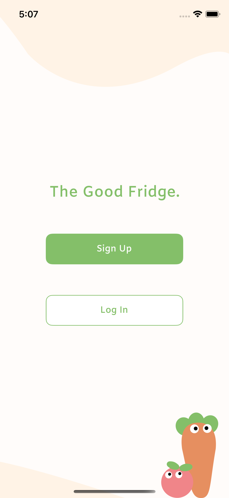
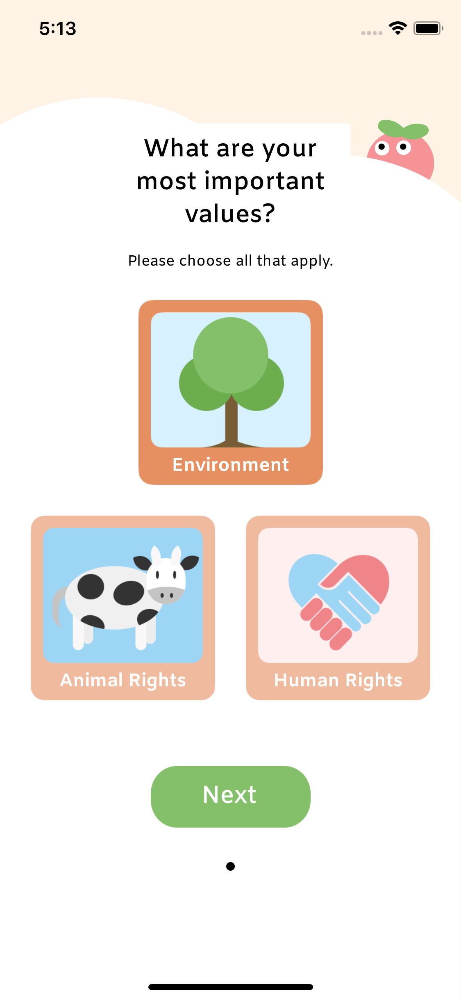
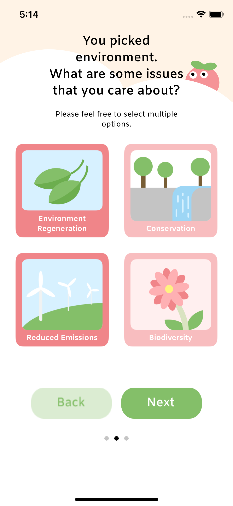
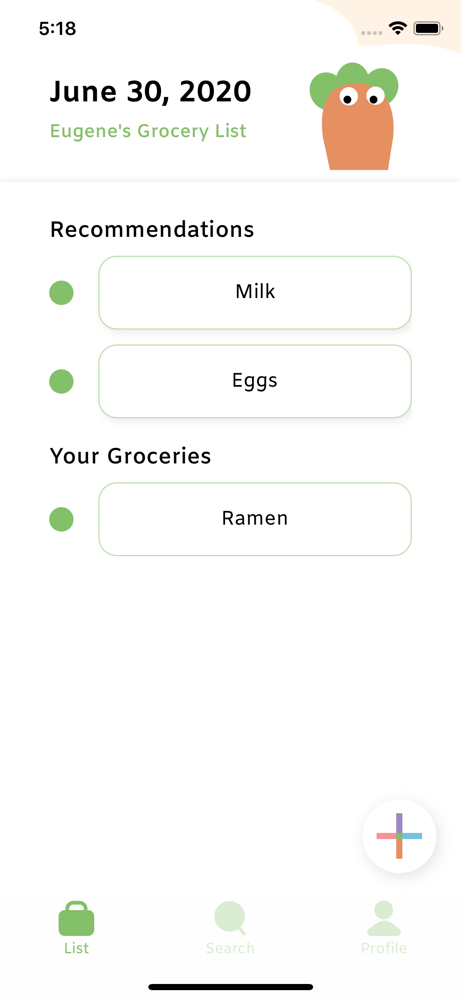

Setup:
From the root directory:
- `cd TheGoodFridge`. You should now be in the directory that contains `Podfile`.
- Run `pod install` to install third party libraries

# The Good Fridge App

## Links
- <a href="https://www.figma.com/file/QDNwydQpSXUtL1cj4uuHls?embed_host=notion&kind=&node-id=0%3A1&viewer=1">Design</a>
- <a href="https://github.com/TheGoodFridge-App/app-tgf">App - Github Repo</a>
- <a href="https://github.com/TheGoodFridge-App/server-tgf">Server - Github Repo</a>

## Introduction

     

The Good Fridge is a mobile application that guides users to make ethical decisions in their grocery purchases. In particular, it aspires to help consumers who care about the impact of their food consumption, but are overwhelmed by all the information and are at a loss for where to start. With the app's main features - registration/setup, grocery list, and profile - we aim to provide a personalized and intuitive interface that encourages the active search for food products that are fair trade, organic, cage-free, and more.

This README gives an overview of the frontend iOS app. For more information about how the server was created, take a look at our [server repo](https://github.com/TheGoodFridge-App/server-tgf).

## Registration/Setup

     
     

After signing up, users are greeted with a setup process that asks for specific values (environmental, animal rights, human rights) that they are particularly passionate about. Users can then further select specific issues within these categories, such as pollution, human breeding, and humane breeding. Based on these selections, the app presents personalized challenges that encourage the user to make ethical decisions. These challenges are directly linked to the user's account, so their progress can always be checked in the profile page.

## Grocery List

     
     

Users are able to create their own grocery list to keep track of different products. For any product that is eligible, recommended products are pulled from the database. These recommended products are selected with machine learning, using **Google Cloud Platform's** sentiment analysis. Based on how positively/negatively each of these products are talked about in conjunction with different ethical labels (i.e. organic, fair trade), they are assigned an ethical rating. The server then collects the top 3 rated products and sends it to the app, where it is presented here. When the user successfully purchases one of the products here, they can select it, in which case the app updates any challenge the action relates to. If a challenge is completed, a notification will be presented to the user.

## Profile
This is a work in progress!

